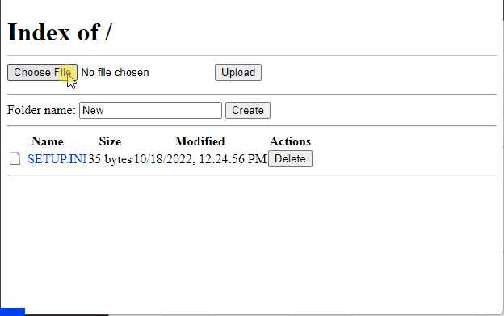

# esp-file-server

This project is an asynchronous web file server created with PlatformIO for ESP8266 using the Arduino framework. Using a web interface, it allows you to upload, download, delete, and manage files and folders on the ESP8266 device.

## Table of Contents

- [Introduction](#introduction)
- [Features](#features)
- [Getting Started](#getting-started)
  - [Checking Your IP Address](#checking-your-ip-address)
  - [Connecting Your Device](#connecting-your-device)
  - [Software Requirements](#software-requirements)
  - [Installation](#installation)
- [Usage](#usage)
  - [Uploading Files](#uploading-files)
  - [Downloading Files](#downloading-files)
  - [Deleting Files and Folders](#deleting-files-and-folders)
  - [Viewing File List](#viewing-file-list)
- [Contributing](#contributing)
- [Extra](#extra)
- [License](#license)

## Introduction

This project provides a convenient way to manage files on an ESP8266 device using a web interface. It utilizes the ESPAsyncWebServer library to handle asynchronous web requests, allowing for smooth file upload and management operations.

## Features

- Upload files to the ESP8266 device.
- Download files from the device.
- Delete files and folders.
- View the list of files and folders on the device.
- Asynchronous handling of web requests for improved performance.

## Getting Started

### Checking Your IP Address

Before connecting to the ESP8266 device, knowing its IP address is essential. You can find this by opening the serial terminal in your PlatformIO IDE or Arduino IDE after uploading the code to the ESP8266. The IP address will be displayed on the serial terminal.

### Connecting Your Device

1. Connect your ESP8266 development board to your computer using a micro-USB cable.

### Software Requirements

- PlatformIO IDE

### Installation

1. Clone or download this repository to your local machine.
2. Open the project in PlatformIO IDE.
3. Configure your Wi-Fi credentials in the `config.h` file.
4. Insert the SD card into the appropriate slot on the ESP8266 board.
5. Upload the code to your ESP8266 board using PlatformIO IDE. The necessary libraries will be automatically downloaded.

## Usage

### Uploading Files

1. Connect your device to the same Wi-Fi network as your computer.
2. Open a web browser and enter the IP address of the ESP8266 device.
3. Click the "Upload Files" option.
4. Select the file you want to upload and click "Upload."
5. The upload progress will be displayed, and the file will be stored on the device.

### Downloading Files

1. Click on the file name you want to download from the main page.
2. The file will be downloaded to your computer.

### Deleting Files and Folders

1. From the main page, find the file or folder you want to delete.
2. Click the "Delete" button to remove the selected item.

### Creating Folders

1. Enter the name of the new folder in the text box "Folder name."
2. From the main page, click the "Create" button.
3. The new folder will be created on the device.

### Viewing File List

1. Access the main page of the web interface.
2. The list of files and folders on the device will be displayed.

## Extra

I'm tired of waiting for the firmware to be uploaded to the device. So I somehow implemented a Python server to test the code without a device. This server is built for debugging purposes only, so use it at your own risk

## Contributing

Contributions to this project are welcome! If you find any issues or have suggestions for improvements, please create a pull request or open an issue.

## License

This project is licensed under the [MIT License](LICENSE). Feel free to use, modify, and distribute the code for your own purposes.
